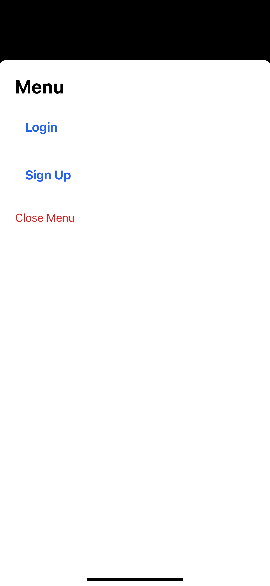
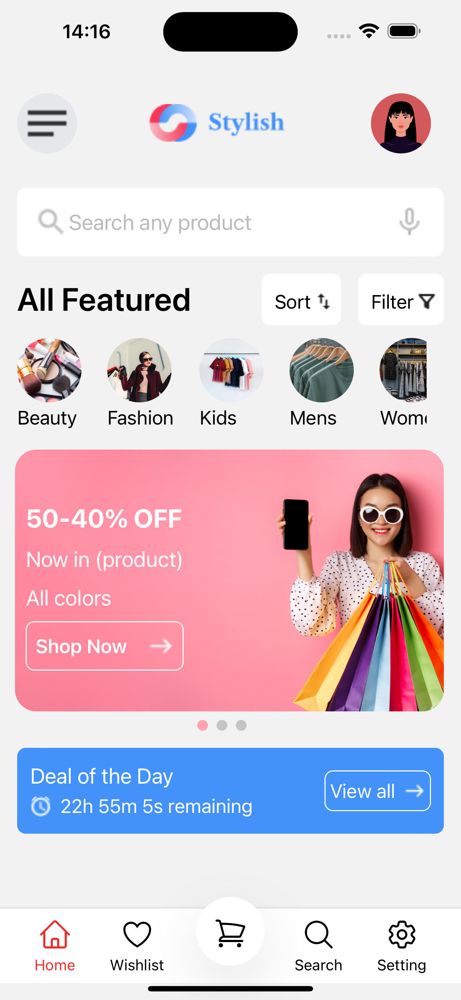
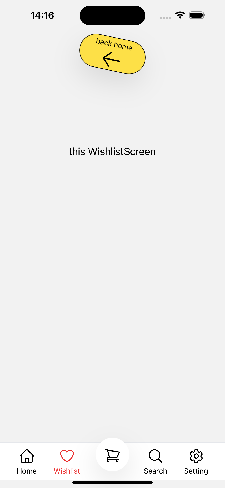
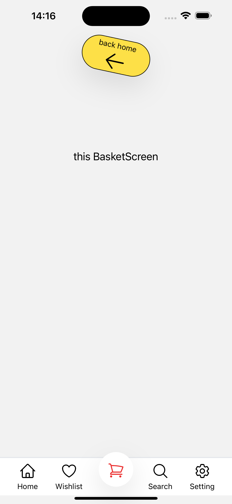
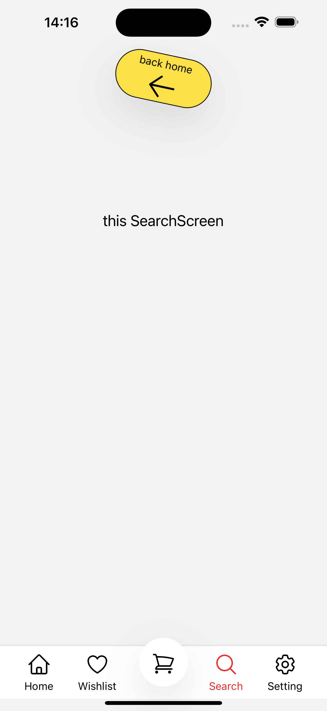
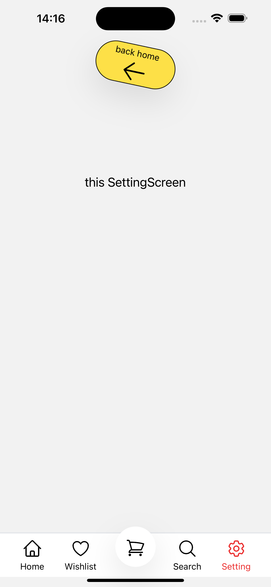

## Table of Contents
- [Installation](#Installation)
- [Usage](#usage)
- [Documentation](#Documentation)


## Installation

1. Clone the repo:
   ```bash
   git clone git@github.com:mouradden/stylish_app_react_native.git

2. Enter the directory

   ```bash
   cd stylish_app_react_native
   ```
3. Install dependencies

   ```bash
   npm install
   ```

4. Start the app

   ```bash
    npx expo start
   ```

## Usage
* In the output, you'll find options to open the app in a

- [Android emulator](https://docs.expo.dev/workflow/android-studio-emulator/)
- [iOS simulator](https://docs.expo.dev/workflow/ios-simulator/)

   * At this stage, make sure a simulator is runing

5. run the app on a simulator

   * For ios, press i
   ```bash
    i
   ```
   * For android, press a
   ```bash
    a
   ```

   * And every time you can reload the app, press r
   ```bash
    r
   ```

## Documentation

- [Technologies Used](#technologies-used)
- [The Screens](#the-screens)
- [HomeScreen](#homescreen)
- [SplashScreen](#splashscreen)
- [LoginScreen](#login-screen)
- [SignUpScreen](#signup-screen)


### Technologies Used


### The Screens
The app consists of several screens that allow users to navigate through various features. Below is a detailed description of each screen:

1. **SplashScreen**: The initial screen displayed when the app starts.
2. **LoginScreen**: The screen where users can log into their account.
3. **SignUpScreen**: The screen where users can register for a new account.
4. **HomeScreen**: The main screen of the app where the search area, the categories, the offers and the deals.
4. **Additional Screens**: Other screens, such as Wishlist, Basket, Search, and Setting, for testing purpose of the navBar.

### HomeScreen
**Key Features:**
- Every part on a seperate component.
- The Offer Cards are scrollable, and scroll automatically every 5 seconds.
- A deal of the day card that includes a count down timer.

**Demo :**

   - For easily testing to navigate the login and signup screens, i create a menu that shows up when clicking on the menu icon in the very top left of the home screen.

<div style="display: flex; justify-content: center;">

  
  
  

</div>

   - The bottom navbar navigation works perfectly, for testing it a create additional screens

<div style="display: flex; justify-content: center;">

  
  
  
  
  
  

</div>

### SplashScreen
The `SplashScreen` is the first screen users encounter when they open the app. It serves as a loading screen while the app initializes, potentially displaying a logo or animation before navigating to the `LoginScreen`.

**Key Features:**
- Displays the app logo.
- Contains three pages with "Prev" and "Next" scroll buttons.
- Includes a "Skip" button to bypass all pages at any time.

### LoginScreen
The `LoginScreen` allows users to log into their accounts. It also provides an option to directly navigate to the SignUp screen for new users.

### SignUpScreen
The `SignUpScreen` enables new users to create an account. It features a form for entering the following details:
- Username
- Email address
- Password
- Confirm password
